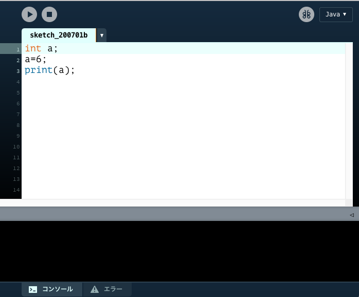

# 変数と型
## まえおき
プログラミングらしい話になってきます．

## 定義と代入
### 変数とは
箱です．数字を入れることができます．

### 箱の作り方
```java
int a;
```
これでaという箱が作られました．```int```は「整数を入れる箱を作れ」というおまじないです．
実行してでてきた小さいウィンドウ[^1]は無視しましょう．

[^1]:size();関数で何も設定しなかったので最小サイズのウィンドウがでてきてしまいました．

### 箱に数を入れる

このままだと，箱が空っぽなので数を入れます
```java
int a;
a=6;
```
```a=6```が追加されました．これでaという名前の箱に6が入りました．注意するのはここでのイコール=は，等しいという意味ではありません．「代入する」という意味です．
ところで，本当にaに6が入っているかどうか気になりますね．そこで，aという箱の中に何が入っているかを確認します．
```java
int a;
a=6;
print(a);
```
```print();```命令は，コンソールに表示させる命令です．



下の黒いところがコンソールです．
実行ボタンを押すとそこに6と表示されます．


地味ですね．別の数字も試して，結果がどうなるかを確認しましょう．また，次のコードのように定義と代入を同時に行うことができます．

```java
int a=6;
print(a);
```


### 変数のルール

今度は値を代入せずに表示させます．

```java
int a;
print(a);
```

実行すると


英語ができてました．エラー文といいます．これを読んで何がエラーの原因なのかを考えます．英語が読めなかったのでGoogle先生に任せます．


原因はaに何も値を入れていないことです．aという変数を作ったけれど，中身は空っぽなので表示できません[^2]！という意味です．

[^2]: NullとかNoneと表示される言語もあります

また，```int a```でaという名前の変数を作らなかった場合もエラーになります．

```java
a=28;
print(a);
```


### 式で代入

```java
int a;
a=1+3;
print(a);
```

このように式で代入することもできます．

| すること | 演算子 |例|aの値 
| :-: | :-: |:-:|:-:|
| 足し算 | ```+```|```a=24+41```|```65```|
| 引き算 | ```-```|```a=5-12```|```-7```|
|掛け算|```*```|```a=25*8```|```200```|
|割り算|```/```|```a=76/19```|```4```|
|割った余り[^3]|```%```|```a=25%4```|```1```|

[^3]:数学でいうと合同式のmodのようなものです．合同式とその性質は競技プログラミングでしばしば使います．


次のコードをえええええもおおおおおお察しろおおおおおおお！！！！
```java
int a=5;
a=a+5;
print(a);
```


### 演習3-1
>次のプログラムを実行して表示される数はいくつか．
>```java
>int a=5;
>int b=3;
>a=a+b;
>b=a-b;
>print(b);
>```


### 解答
<details><summary>解答</summary><div>
演習3-1：-5

```java
a=a+b;//a=5+3 aが8
b=a-b;//b=3-8 bが-5
```

</div></details>

## 変数の活用方法

```java
size(500,500);
elli
```
